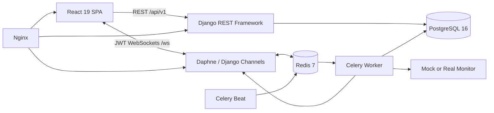

# Smart Network Monitoring and Device Management Dashboard

## P2 enterprise NOC operation

The operational layer adds a server-derived NOC health summary, worst-first site health, incident management, maintenance windows, explicit topology links, a dark wallboard, and site-scoped access. The deterministic health score starts at 100 and subtracts `(15 × down devices + 6 × degraded devices + 8 × critical alerts + 4 × high alerts + 3 × open incidents) / max(device count, 1)`, bounded to 0–100. Its contributors are exposed beside the score; it is not an ML prediction.

Operator flow: identify the worst site, inspect its resource and alert, create or attach an incident, assign it, record investigation comments, verify recovery, then resolve and close the incident. Planned maintenance keeps telemetry running while alerts retain an explicit suppression marker and critical notification is withheld. P2 endpoints remain under `/api/v1/`: `noc/summary/`, `incidents/`, `maintenance/`, `topology/`, and `topology/links/`.

SNMADMDCP is a full-stack network operations dashboard for discovering devices, tracking availability and traffic, managing alerts, visualizing topology, generating reports, and auditing user activity. It combines a React SPA with a versioned Django REST API, JWT authentication, real-time WebSockets, and scheduled Celery monitoring jobs.

> Use real network discovery only on networks you own or are explicitly authorized to scan. The default `mock` mode is safe for development, demonstrations, and CI.

## Contents

- [Features](#features)
- [Architecture](#architecture)
- [Technology stack](#technology-stack)
- [Project structure](#project-structure)
- [Prerequisites](#prerequisites)
- [Quick start with Docker](#quick-start-with-docker)
- [Local development](#local-development)
- [Demo data and accounts](#demo-data-and-accounts)
- [Configuration](#configuration)
- [API and WebSockets](#api-and-websockets)
- [Monitoring jobs](#monitoring-jobs)
- [Testing](#testing)
- [Production deployment](#production-deployment)
- [Troubleshooting](#troubleshooting)
- [Documentation](#documentation)
- [Security and license](#security-and-license)

## Features

- Live dashboard metrics and authenticated WebSocket updates
- Device inventory, discovery, status history, latency, and details
- Traffic sampling, summaries, trends, and bandwidth charts
- Alert rules, severity, acknowledgement, and optional email delivery
- Interactive network topology graph
- PDF and spreadsheet report generation and download
- Device-growth, traffic, alert, and security analytics
- JWT login, token rotation, logout, password reset, and profiles
- Administrator and network-analyst roles
- User administration and activity auditing
- Safe mock monitoring and authorized ping-based real monitoring
- Generated OpenAPI schema and Swagger UI
- Docker Compose development and production-oriented configurations

## Architecture



Celery Beat schedules monitoring work. Workers persist results in PostgreSQL and broadcast changes through Channels. The frontend uses TanStack Query for server state and refreshes affected data when real-time events arrive.

## Technology stack

| Layer | Technologies |
| --- | --- |
| Frontend | React 19, TypeScript, Vite 8, React Router, TanStack Query, Axios |
| Visualization | Recharts, react-force-graph-2d, Lucide |
| Backend | Python 3.12+, Django 5, Django REST Framework |
| Authentication | Simple JWT with rotating, blacklisted refresh tokens |
| Real time | Django Channels, Daphne, Redis |
| Jobs | Celery and Celery Beat |
| Persistence | PostgreSQL 16; optional SQLite local mode |
| Reports | ReportLab and OpenPyXL |
| API docs | drf-spectacular, OpenAPI, Swagger UI |
| Testing | pytest, pytest-django, Vitest, Testing Library |
| Deployment | Docker Compose, Nginx, Gunicorn/Daphne |

## Project structure

```text
SNMADMDCP/
├── backend/
│   ├── apps/
│   │   ├── accounts/       # Authentication, users, roles, profiles
│   │   ├── alerts/         # Alerts, rules, acknowledgement
│   │   ├── analytics/      # Dashboard metrics and trends
│   │   ├── audit/          # Activity log and middleware
│   │   ├── devices/        # Inventory and status history
│   │   ├── monitoring/     # Collectors, tasks, WebSockets
│   │   ├── reports/        # Report generation and downloads
│   │   ├── topology/       # Network graph data
│   │   └── traffic/        # Samples and summaries
│   ├── config/             # Settings, URLs, ASGI, WSGI, Celery
│   ├── tests/
│   ├── Dockerfile
│   └── requirements.txt
├── frontend/
│   ├── src/
│   │   ├── api/            # Axios and JWT refresh client
│   │   ├── components/
│   │   ├── contexts/       # Authentication and theme
│   │   ├── hooks/          # WebSocket client
│   │   └── pages/
│   ├── Dockerfile
│   └── package.json
├── docker/nginx.conf
├── docs/
├── monitoring-agent/       # Optional collector placeholder
├── .env.example
├── docker-compose.yml
└── docker-compose.prod.yml
```

## Prerequisites

Choose Docker or a local toolchain.

| Tool | Version | Required for |
| --- | --- | --- |
| Docker and Docker Compose | Current / Compose v2 | Container setup |
| Python | 3.12+ | Local backend |
| Node.js | 18+; 22 recommended | Local frontend |
| PostgreSQL | 16 recommended | Standard database |
| Redis | 7 recommended | Channels and Celery |

## Quick start with Docker

Docker starts PostgreSQL, Redis, Django/Daphne, Celery Worker, Celery Beat, and the Vite frontend.

```powershell
Copy-Item .env.example .env
docker compose up --build
```

Review `.env` first. Compose overrides `DB_HOST`, `REDIS_URL`, and `MONITORING_MODE` with container-safe values. Change the example database password in both `.env` and `docker-compose.yml` if the environment is accessible to others.

| Service | URL |
| --- | --- |
| Application | http://localhost:5173 |
| REST API | http://localhost:8000/api/v1/ |
| Swagger UI | http://localhost:8000/api/schema/swagger/ |
| OpenAPI schema | http://localhost:8000/api/schema/ |
| Django admin | http://localhost:8000/admin/ |

The backend applies migrations and seeds demo data when it starts. Stop with `Ctrl+C`, then remove the containers with:

```powershell
docker compose down
```

`docker compose down -v` also permanently deletes the Compose-managed database and media volumes.

## Local development

### Lightweight SQLite demo

This mode only needs Python and Node.js. It uses SQLite, an in-memory Channels layer, and eager Celery execution. It is useful for UI/API evaluation but does not reproduce the full multi-process architecture.

Backend:

```powershell
Set-Location backend
python -m venv venv
.\venv\Scripts\Activate.ps1
python -m pip install -r requirements.txt
$env:DJANGO_SETTINGS_MODULE = "config.settings.local"
python manage.py migrate
python manage.py seed_demo
daphne -b 0.0.0.0 -p 8000 config.asgi:application
```

Frontend, in another terminal:

```powershell
Set-Location frontend
npm install
npm run dev
```

On Bash, use `source venv/bin/activate` and `export DJANGO_SETTINGS_MODULE=config.settings.local`.

### Full local stack

Use PostgreSQL and Redis to exercise background scheduling and cross-process real-time updates.

1. Copy `.env.example` to `.env` and configure:

   ```dotenv
   DJANGO_SETTINGS_MODULE=config.settings.dev
   DB_NAME=snmadmdcp
   DB_USER=postgres
   DB_PASSWORD=replace-with-your-password
   DB_HOST=localhost
   DB_PORT=5432
   REDIS_URL=redis://localhost:6379/0
   CORS_ORIGINS=http://localhost:5173
   MONITORING_MODE=mock
   ```

2. Create the PostgreSQL database. See [docs/postgresql-setup.md](docs/postgresql-setup.md).

3. Start Redis, for example:

   ```powershell
   docker run -d --name snm-redis -p 6379:6379 redis:7-alpine
   ```

4. Initialize the backend:

   ```powershell
   Set-Location backend
   python -m venv venv
   .\venv\Scripts\Activate.ps1
   python -m pip install -r requirements.txt
   python manage.py migrate
   python manage.py seed_demo
   ```

5. Install the frontend with `npm install` inside `frontend/`.

6. Run four terminals:

   ```powershell
   # 1: API and WebSockets
   Set-Location backend
   .\venv\Scripts\Activate.ps1
   daphne -b 0.0.0.0 -p 8000 config.asgi:application
   ```

   ```powershell
   # 2: background jobs
   Set-Location backend
   .\venv\Scripts\Activate.ps1
   celery -A config worker -l info
   ```

   ```powershell
   # 3: scheduler
   Set-Location backend
   .\venv\Scripts\Activate.ps1
   celery -A config beat -l info
   ```

   ```powershell
   # 4: frontend
   Set-Location frontend
   npm run dev
   ```

`python manage.py runserver` is sufficient for basic REST development; use Daphne when testing WebSockets.

## Demo data and accounts

`python manage.py seed_demo` creates sample devices, traffic, device status history, alerts, an alert rule, an audit record, and these users:

| Username | Password | Role |
| --- | --- | --- |
| `admin` | `admin123` | Administrator / Django superuser |
| `analyst` | `analyst123` | Network analyst |

The command uses idempotent lookups and can be rerun. Passwords are assigned only when each user is first created. These credentials are strictly for local demonstrations; change or remove them before deployment.

## Configuration

### Backend variables

| Variable | Default | Purpose |
| --- | --- | --- |
| `DJANGO_SETTINGS_MODULE` | `config.settings.dev` | Selects `dev`, `local`, `test`, or `prod` |
| `SECRET_KEY` | Insecure development fallback | Django signing secret; set a unique production value |
| `DEBUG` | `True` | Debugging and development media serving |
| `ALLOWED_HOSTS` | `localhost,127.0.0.1` | Comma-separated host allowlist |
| `CORS_ORIGINS` | `http://localhost:5173` | Comma-separated frontend origins |
| `DB_NAME` | `snmadmdcp` | PostgreSQL database |
| `DB_USER` | `postgres` | PostgreSQL user |
| `DB_PASSWORD` | `postgres` | PostgreSQL password |
| `DB_HOST` | `localhost` | PostgreSQL host; `db` in Compose |
| `DB_PORT` | `5432` | PostgreSQL port |
| `REDIS_URL` | `redis://localhost:6379/0` | Channels, broker, and result store |
| `JWT_ACCESS_MINUTES` | `15` | Access-token lifetime |
| `JWT_REFRESH_DAYS` | `7` | Refresh-token lifetime |
| `MONITORING_MODE` | `mock` | `mock` or `real` collector |
| `SUBNET_CIDR` | `192.168.1.0/24` | Authorized discovery range |
| `EMAIL_*` | Varies | Optional SMTP connection and sender settings |
| `TELEGRAM_BOT_TOKEN` | Empty | Reserved Telegram integration token |
| `THREAT_INTEL_API_KEY` | Empty | Reserved threat-intelligence key |

### Frontend variables

Create `frontend/.env` if the defaults do not fit:

```dotenv
VITE_API_URL=http://localhost:8000/api/v1
VITE_WS_URL=ws://localhost:8000
```

When served through Nginx on the same origin, the API client can use its default relative `/api/v1` path. Vite variables are embedded at build time.

## API and WebSockets

Protected requests use `Authorization: Bearer <access-token>`.

| Area | Endpoints |
| --- | --- |
| Authentication | `POST /api/v1/auth/login/`, `refresh/`, `logout/`, `password-reset/` |
| Profile | `GET/PATCH /api/v1/auth/profile/` |
| Registration | `POST /api/v1/auth/register/` (administrator) |
| Users | `/api/v1/users/` and `/api/v1/users/{id}/` |
| Devices | `/api/v1/devices/`, `/{id}/history/`, `/discover/` |
| Traffic | `/api/v1/traffic/`, `/summary/` |
| Alerts | `/api/v1/alerts/`, `/{id}/acknowledge/` |
| Reports | `/api/v1/reports/`, `/generate/`, `/{id}/download/` |
| Analytics | `/api/v1/analytics/device-growth/`, `traffic-trends/`, `alert-trends/`, `security-stats/` |
| Dashboard | `/api/v1/dashboard/metrics/` |
| Topology | `/api/v1/topology/` |
| Audit | `/api/v1/activity-logs/` (administrator) |

List endpoints use page-number pagination and commonly support `search`, resource filters such as `status` or `alert_level`, and `ordering`. Swagger is the authoritative schema for the running version.

WebSockets accept the access token as a query parameter:

```text
ws://localhost:8000/ws/dashboard/?token=<access-token>
ws://localhost:8000/ws/devices/?token=<access-token>
ws://localhost:8000/ws/alerts/?token=<access-token>
```

Use `wss://` behind HTTPS. Because query strings may appear in logs, redact them in production and retain short access-token lifetimes.

## Monitoring jobs

| Job | Schedule | Responsibility |
| --- | --- | --- |
| `discover_devices` | Every 5 minutes | Discovers devices |
| `check_device_status` | Every minute | Updates availability and latency |
| `sample_traffic` | Every 30 seconds | Records traffic measurements |
| `evaluate_alert_rules` | Every minute | Creates matching alerts |
| `cleanup_old_traffic` | Daily at 02:00 UTC | Removes expired samples |

`mock` mode generates demonstration data. `real` mode uses network-aware collection and can require ICMP/raw-socket privileges. Linux containers may need a narrowly scoped `NET_RAW` capability. Windows users will generally have a smoother setup through an authorized WSL2 or lab environment.

Current monitoring code lives in `backend/apps/monitoring/`; `monitoring-agent/` describes a future standalone collector.

## Testing

```powershell
# Backend
Set-Location backend
.\venv\Scripts\Activate.ps1
pytest -q
ruff check .

# Frontend
Set-Location ..\frontend
npm run test
npm run lint
npm run build
```

GitHub Actions tests the backend with PostgreSQL and Redis, then builds and tests the frontend. Docker image construction follows on main/master. The current CI Ruff step reports findings without failing the job.

## Production deployment

Build the SPA, configure production secrets, and apply the Compose overlay:

```powershell
Set-Location frontend
npm ci
npm run build
Set-Location ..
docker compose -f docker-compose.prod.yml up -d --build
```

The production file runs Daphne/ASGI behind Nginx so REST and WebSockets use the same application service. Only Nginx publishes host port 80; terminate TLS at an upstream load balancer or add a reviewed certificate-enabled Nginx server before exposure. PostgreSQL, Redis, Django, and Celery remain on an internal Docker network. Nginx serves `frontend/dist`, proxies `/api/`, `/ws/`, `/media/`, and `/static/`, and provides SPA route fallback.

Before exposure:

- Set a strong `SECRET_KEY`, strong DB credentials, `DEBUG=False`, and exact host/CORS allowlists.
- Configure valid TLS at Nginx or an upstream load balancer.
- Do not expose PostgreSQL or Redis publicly.
- Remove or rotate demo accounts and example passwords.
- Configure database backups, restore tests, logging, and monitoring.
- Restrict discovery to explicitly authorized CIDRs.
- Configure SMTP if alerts or password resets use email.
- Run `python manage.py collectstatic` when proxying Django admin static files.

## Troubleshooting

### Frontend loads but API calls fail

- Confirm the backend is available on port 8000.
- Check `VITE_API_URL` and restart Vite after environment changes.
- Add the exact frontend origin to `CORS_ORIGINS`.
- Container hostnames `db` and `redis` are not browser hostnames.

### PostgreSQL refuses connections

- Verify the service, host, port, database, role, and password.
- In Compose, wait for the health check and inspect `docker compose logs db backend`.

### WebSockets fail

- Use Daphne/ASGI and verify Redis at `REDIS_URL`.
- Include a current access token in `?token=`.
- Preserve Nginx `Upgrade` and `Connection` headers.
- Use `wss://` when the page uses HTTPS.

### Celery jobs do not run

- Run both Worker and Beat with the same Redis URL and Django settings.
- Inspect `docker compose logs celery_worker celery_beat`.
- The SQLite settings make invoked tasks eager but do not create recurring schedules without Beat.

### PowerShell blocks activation

With an administrator-approved policy, use:

```powershell
Set-ExecutionPolicy -Scope Process -ExecutionPolicy Bypass
.\venv\Scripts\Activate.ps1
```

Or call `.\venv\Scripts\python.exe` directly.

## Documentation

| Document | Purpose |
| --- | --- |
| [Software requirements](docs/SRS.md) | Scope and requirements |
| [Architecture](docs/architecture.md) | Components and data flow |
| [API documentation](docs/api-docs.md) | REST and WebSocket summary |
| [Database schema](docs/database-schema.md) | Tables and relationships |
| [ER diagram](docs/er-diagram.md) | Entity relationships |
| [Class diagram](docs/class-diagram.md) | Application model view |
| [Use cases](docs/use-cases.md) | User/system interactions |
| [Developer guide](docs/developer-guide.md) | Implementation guidance |
| [Deployment guide](docs/deployment-guide.md) | Deployment checklist |
| [User manual](docs/user-manual.md) | End-user workflows |
| [PostgreSQL setup](docs/postgresql-setup.md) | Database setup |
| [Monitoring guide](docs/monitoring-guide.md) | Authorized targets, collectors, telemetry, availability, and alerts |
| [SNMP guide](docs/snmp-guide.md) | SNMPv2c/v3 configuration, OIDs, secret boundary, and support status |

## Security and license

- Never commit a real `.env`, secret, SMTP credential, API key, or token.
- Replace the password currently shown in `.env.example`; do not reuse examples in deployed systems.
- Keep `DEBUG=False`, enable HTTPS, and use exact allowlists in production.
- Treat reports, audit logs, device metadata, and topology as sensitive operational data.
- Monitor only with authorization and least-privilege network access.
- Review dependencies and base images regularly.

No license file is currently included. Unless the project owner adds one, the source is not automatically licensed for redistribution or reuse.
