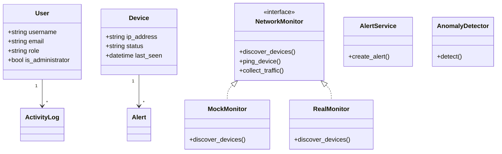

# Class Diagram

```mermaid
classDiagram
    class User {
        +string username
        +string email
        +string role
        +bool is_administrator
    }
    class Device {
        +string ip_address
        +string status
        +datetime last_seen
    }
    class NetworkMonitor {
        <<interface>>
        +discover_devices()
        +ping_device()
        +collect_traffic()
    }
    class MockMonitor {
        +discover_devices()
    }
    class RealMonitor {
        +discover_devices()
    }
    class AlertService {
        +create_alert()
    }
    class AnomalyDetector {
        +detect()
    }
    NetworkMonitor <|.. MockMonitor
    NetworkMonitor <|.. RealMonitor
    Device "1" --> "*" Alert
    User "1" --> "*" ActivityLog
```
