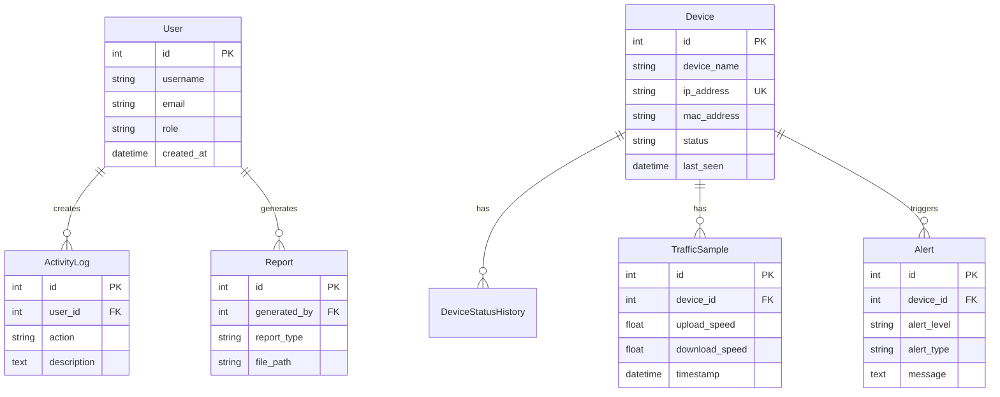

# ER Diagram

```mermaid
erDiagram
    User ||--o{ ActivityLog : creates
    User ||--o{ Report : generates
    Device ||--o{ DeviceStatusHistory : has
    Device ||--o{ TrafficSample : has
    Device ||--o{ Alert : triggers
    User {
        int id PK
        string username
        string email
        string role
        datetime created_at
    }
    Device {
        int id PK
        string device_name
        string ip_address UK
        string mac_address
        string status
        datetime last_seen
    }
    TrafficSample {
        int id PK
        int device_id FK
        float upload_speed
        float download_speed
        datetime timestamp
    }
    Alert {
        int id PK
        int device_id FK
        string alert_level
        string alert_type
        text message
    }
    Report {
        int id PK
        int generated_by FK
        string report_type
        string file_path
    }
    ActivityLog {
        int id PK
        int user_id FK
        string action
        text description
    }
```
