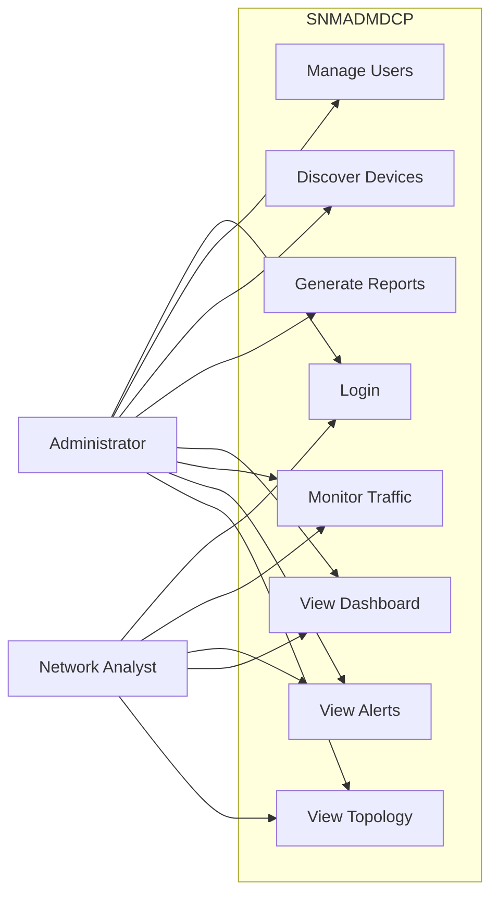

# Use Case Diagram

```mermaid
flowchart LR
    Admin[Administrator]
    Analyst[Network Analyst]
    subgraph system [SNMADMDCP]
        UC1[Login]
        UC2[Manage Users]
        UC3[Discover Devices]
        UC4[Monitor Traffic]
        UC5[View Alerts]
        UC6[Generate Reports]
        UC7[View Dashboard]
        UC8[View Topology]
    end
    Admin --> UC1
    Admin --> UC2
    Admin --> UC3
    Admin --> UC6
    Admin --> UC7
    Analyst --> UC1
    Analyst --> UC4
    Analyst --> UC5
    Analyst --> UC7
    Analyst --> UC8
    Admin --> UC4
    Admin --> UC5
    Admin --> UC8
```
